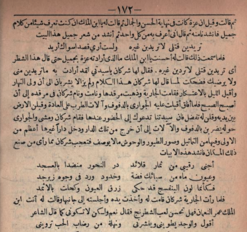
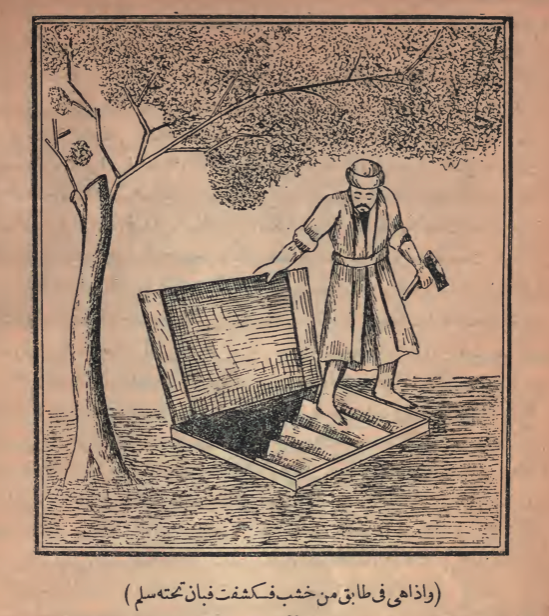
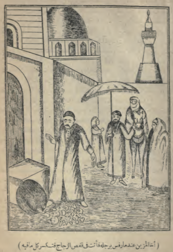
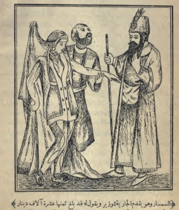

# Professional Data Entry for the 1835 Bulaq edition of the Thousand and One Nights
Gregory Crane

July 24, 2021

Barnegat Light NJ

I am putting up a textual transcription of an Arabic edition of the Thousand and One Nights that is raw but could be of great use by itself and be developed for a variety purpose.

In 2009, support from the Department of Education allowed us to have several Arabic sources keyed in by [Digital Divide data](https://www.digitaldividedata.com/). Going back over older work that I had done with Arabic in July 2021, I realized that we had a transcription of the 1835 Bulaq edition of the Thousand and One Nights (also commonly known by a transliteration of its Arabic title: Elfleilawaleila) was still waiting to be made available online. The original data entry files have been languishing on a copy of an old CVS repository.

The quality of the data entry *should* be high but that remains to be measured. The Thousand and One Nights is not a small work. The venerable Unix wc command reports that the entered text contains space-delimited 1,777,767 tokens and 62,658,048 characters.

The Scaife Viewer -- the evolving successor to the still current Perseus digital Library reading environment -- has already been used to publish Arabic as part of the ERC-funded [Kitab Project](http://kitab-project.org/) and so this source could be made available. 

For now I publish the raw files that we received from DDD. The text should immediately be useful for text mining. To create a readable version will require additional markup and that will certainly take a fair amount of work, not least because the text mixes poetry with prose and the poetry needs to be split into two columns as in the [example below from the Internet Archive](https://archive.org/details/alflailwalail01bulauoft/page/n180/mode/2up).

DDD worked with scans from a copy at the University of Toronto that are available from the Internet Archive:

1. [Volume 1](https://archive.org/details/alflailwalail01bulauoft/)
2. [Volume 2](https://archive.org/details/alflailwalail02bulauoft/)
3. [Volume 3](https://archive.org/details/alflailwalail03bulauoft/)
4. [Volume 4](https://archive.org/details/alflailwalail03bulauoft/)

The Bulaq edition includes as well a series of illustrations that are available in the Internet Archive scans and that bear study in their own right: e.g., 

[Volume 1,scan 44](https://archive.org/details/alflailwalail01bulauoft/page/44/mode/1up)

[Volume 1, scan 117](https://archive.org/details/alflailwalail01bulauoft/page/117/mode/1up)

[Volume 1, scan 130](https://archive.org/details/alflailwalail01bulauoft/page/n130/mode/1up)

My understanding is that this Arabic edition formed the basis for the first complete and uexpurgated translation of the Thousand and One Nights, which was published in 1884-1889. If so, the Arabic and English versions can be automatically aligned to explore the general relationship between the two versions, with close reading and manual alignments of particular passages. 

An updated version of the translation, revised to provide more transparent alignment with the Arabic, could, when combined with morpho-syntactic and grammatical analysis serve as the basis for an interactive course on Classical Arabic. For an introductory (c. 1 year) course, a carefully corrected and annotated corpus of 5,000-10,000 running words is more than adequate. 

